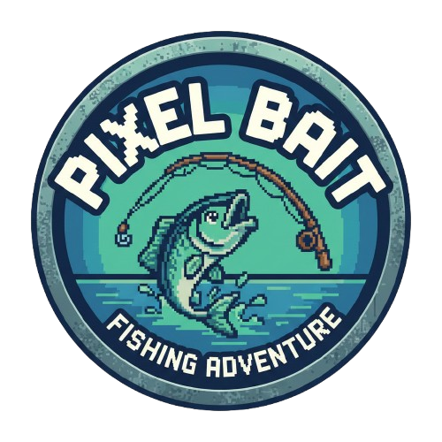

# 🎣 Fishingman

**Fishingman** is an immersive and relaxing fishing simulation game built with **React** and **Vite**. Dive into a pixel-art world, catch rare fish, upgrade your gear, and become the ultimate angler!

**Play Now:** [fishingman.vercel.app](https://fishingman.vercel.app)



## ✨ Features

- **🎣 Realistic Fishing Mechanics**: Test your patience and skill with our interactive fishing system.
- **🐟 Massive Fish Collection**: Discover and collect a wide variety of fish, each with unique rarities and values.
- **🛍️ Shop & Upgrades**: Sell your catch to earn money and upgrade your rods, hooks, and gear in the specialized shop.
- **🎒 Inventory Management**: Manage your backpack, track your catches, and decide what to keep or sell.
- **📈 Leveling System**: Gain XP for every catch, level up to unlock better equipment, and increase your hook capacity.
- **💾 Cloud Save**: Seamlessly save your progress with Supabase integration, ensuring your journey is never lost.
- **🎨 Pixel Art Aesthetic**: Enjoy a charming and nostalgic visual style.

## 🛠️ Technology Stack

This project is built using modern web technologies to ensure performance and scalability:

- **Frontend**: [React](https://reactjs.org/) (Hooks, Functional Components)
- **Build Tool**: [Vite](https://vitejs.dev/)
- **State Management**: React Context / Canvas
- **Backend / Database**: [Supabase](https://supabase.com/) (Auth, Database, Storage)
- **Styling**: CSS Modules / Vanilla CSS

## 🚀 Getting Started

Follow these steps to set up the project locally:

### Prerequisites

- Node.js (v16 or higher)
- npm or yarn

### Installation

1.  **Clone the repository**
    ```bash
    git clone https://github.com/yourusername/mancing-mania.git
    cd mancing-mania
    ```

2.  **Install dependencies**
    ```bash
    npm install
    ```

3.  **Environment Setup**
    Create a `.env` file in the root directory and add your Supabase credentials:
    ```env
    VITE_SUPABASE_URL=your_supabase_url
    VITE_SUPABASE_ANON_KEY=your_supabase_anon_key
    ```

4.  **Run the application**
    ```bash
    npm run dev
    ```

5.  **Build for production**
    ```bash
    npm run build
    ```

## 🎮 How to Play

1.  **Login/Register**: Create an account to save your progress.
2.  **Start Fishing**: Click the "Play" button. Wait for a bite and click at the right time to catch the fish!
3.  **Manage Resources**: Watch your `Hooks` count. They regenerate over time or can be purchased.
4.  **Sell & Upgrade**: Go to the Backpack to sell fish, then visit the Shop to buy better rods (Bamboo, Carbon, Fiberglass, etc.).

## 🤝 Contributing

Contributions are welcome! If you have suggestions for improvements or new features, feel free to fork the repository and submit a pull request.

---

*Happy Fishing!* 🎣
